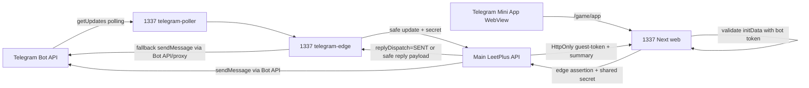

# Telegram edge VDS на 1337

Актуальная правда по переносу лежит в `CURRENT_1337_HANDOFF.md`.

Текущий боевой контур:

- edge domain: `https://tg.leetplus.ru`
- server: 1337, public IP `188.234.220.76`
- project root: `/srv/leetplus-telegram-edge`
- runtime: Docker Compose
- Telegram mode: long polling, не webhook

Telegram webhook должен быть пустым. `telegram-poller` сам делает `deleteWebhook(drop_pending_updates=false)` на старте.

## Что остается на основной VDS

- Backend/API LeetPlus и база данных.
- Бизнес-логика `/guest-portal/telegram/webhook`.
- Создание и проверка Telegram auth challenge.
- Выпуск `leetplus_guest_token`.
- `GET /guest-portal/session/game-summary`.
- Guest Game Hub readiness и аудит.

## Что работает на 1337

- `telegram-poller` получает Telegram updates через `getUpdates`.
- `telegram-edge` пересылает updates в основной API и отправляет safe replies в Telegram только как fallback, если основной API вернул safe `reply` payload.
- `telegram-mini-app-web` обслуживает `/game/app` и `/api/guest-portal/*`.
- `bot-consumer` опционален, profile `consumer`, сейчас держать в dry-run.

## ТЗ правки Telegram UX

- Web `/game/auth` и `/play` должны иметь одну CTA `Войти через Telegram`: перед созданием challenge показывается понятное окно с двумя действиями `Продолжить` и `Другой способ входа`.
- После `Продолжить` web создает challenge, открывает deep link Telegram и poll-ит status endpoint; отдельная вторая кнопка `Открыть бота` не нужна.
- Edge VDS не принимает продуктовых решений: он пересылает safe update в основной API и отправляет полученный `replyMarkup` как opaque JSON.
- После успешного contact-share основной API возвращает не принудительную Mini App кнопку, а выбор из трех продолжений: `Вернуться на сайт LeetPlus`, `Открыть Mini App`, `Продолжить в боте`.
- Возврат на сайт предполагает, что исходная web-страница завершит вход через polling и выдаст HttpOnly `leetplus_guest_token`; Mini App остается отдельным вариантом на `https://tg.leetplus.ru/game/app`, но пока не является обязательным путем.

## Схема



## Файлы

- `CURRENT_1337_HANDOFF.md` - источник правды по текущему серверу 1337.
- `BOT_MINI_APP_TZ.md` - рабочее ТЗ по Telegram-боту и Mini App с учетом UX-правок после production-теста.
- `TRANSFER_SUMMARY.md` - общий summary архитектуры и env.
- `SYNC_TOKEN_TENANT_HANDOFF.md` - откуда брать `SYNC_SERVICE_TOKEN` и tenant slug/id.
- `telegram-edge.env.example` - env-поля для edge.
- `leetplus-telegram-edge.service`, `leetplus-telegram-mini-app-web.service`, `nginx-telegram-edge.conf.example` - legacy/systemd-шаблоны, не основной live-путь 1337.

## Env основной VDS

```env
GUEST_GAME_TELEGRAM_WEBHOOK_REPLY_ENABLED=true
GUEST_GAME_TELEGRAM_WEBHOOK_REPLY_BOT_TOKEN=<telegram-bot-token>
GUEST_GAME_TELEGRAM_MINI_APP_URL=https://tg.leetplus.ru/game/app
GUEST_GAME_TELEGRAM_BOT_USERNAME=leetplusru_bot
GUEST_GAME_TG_EDGE_SHARED_SECRET=<same-as-edge>
GUEST_GAME_TELEGRAM_WEBHOOK_SECRET=<same-as-edge-update-secret>
```

Основная VDS отправляет Telegram replies напрямую. Edge adapter остается в polling-контуре и отправляет сообщения только когда API вернул safe `reply` payload.

## Env 1337

Реальные значения лежат только на сервере:

```text
/srv/leetplus-telegram-edge/secrets/telegram-edge.env
```

Ключевые переменные:

```env
API_URL=https://api.leetplus.ru
NEXT_PUBLIC_API_URL=https://api.leetplus.ru

GUEST_GAME_TG_EDGE_DRY_RUN=false
GUEST_GAME_TG_EDGE_BOT_TOKEN=<secret>
GUEST_GAME_TG_EDGE_WEBHOOK_SECRET=<secret>
GUEST_GAME_TG_EDGE_SHARED_SECRET=<secret>
GUEST_GAME_TG_EDGE_TELEGRAM_API_BASE_URL=https://api.telegram.org

GUEST_GAME_TG_EDGE_POLLING_DELETE_WEBHOOK_ON_START=true
GUEST_GAME_TG_EDGE_POLLING_DROP_PENDING_UPDATES=false
GUEST_GAME_TG_EDGE_POLLING_TIMEOUT_SECONDS=50
GUEST_GAME_TG_EDGE_POLLING_LIMIT=100
GUEST_GAME_TG_EDGE_POLLING_ALLOWED_UPDATES=message,edited_message,callback_query
GUEST_GAME_TG_EDGE_POLLING_STATE_PATH=/app/data/telegram-poller-state.json
GUEST_GAME_TG_EDGE_POLLING_RETRY_DELAY_MS=5000

GUEST_GAME_BOT_CONSUMER_DRY_RUN=true
```

## Обновление

```bash
cd /srv/leetplus-telegram-edge
mkdir -p backups
tar -czf backups/app-before-update-$(date +%Y%m%d-%H%M%S).tgz app docker-compose.yml secrets/telegram-edge.env
```

После замены `/srv/leetplus-telegram-edge/app`:

```bash
cd /srv/leetplus-telegram-edge
docker compose build telegram-edge telegram-poller telegram-mini-app-web
docker compose up -d telegram-edge telegram-poller telegram-mini-app-web
```

Не перетирать:

- `/srv/leetplus-telegram-edge/secrets/telegram-edge.env`
- `/srv/leetplus-telegram-edge/data`
- `/srv/leetplus-telegram-edge/backups`

## Проверка

```bash
cd /srv/leetplus-telegram-edge
docker compose ps
docker compose logs --tail=120 telegram-poller
docker compose logs --tail=80 telegram-edge
docker compose logs --tail=80 telegram-mini-app-web
./telegram-webhook-remote.sh info
./check-nginx-https-site.sh
```

Ожидаемо:

- webhook `url=-`
- `pending_update_count=0` или небольшое число
- `https_game_app_http=200`
- `https_webhook_wrong_secret_http=401`
- `https_root_http=404`

Mini App API proxy:

```bash
curl -ksS -o /dev/null -w 'HTTP:%{http_code}:BYTES:%{size_download}\n' \
  https://tg.leetplus.ru/api/guest-portal/gamification/clubs
```

Ожидаемо: `HTTP:200`.

Финальный canary:

```text
TELEGRAM_AUTH_START status=AWAITING_CONTACT replySent=true
TELEGRAM_AUTH_CONTACT status=CONFIRMED replySent=true
```

В Telegram после contact-share должно прийти сообщение с тремя вариантами продолжения, а не только кнопка `Открыть Mini App`.

## Rollback

- Поставить `GUEST_GAME_TG_EDGE_DRY_RUN=true` на 1337.
- Перезапустить `telegram-edge`, `telegram-poller`, `telegram-mini-app-web`.
- Для отключения Mini App убрать `GUEST_GAME_TELEGRAM_MINI_APP_URL` на основной VDS.
- Для остановки Telegram-входа остановить `telegram-poller` или убрать `GUEST_GAME_TELEGRAM_WEBHOOK_SECRET` на основной VDS.

## Инварианты

- Не включать Telegram webhook, пока используется polling.
- Запускать ровно один `telegram-poller` на bot token.
- Не коммитить `.env`, bot token, sync token, SSH credentials.
- `bot-consumer` держать в dry-run до отдельного live-решения.
- После каждого обновления проверять Telegram canary.
