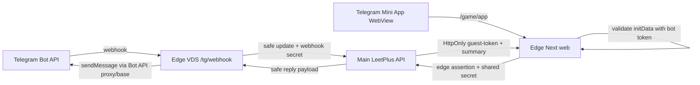

# Telegram edge VDS для бота и Mini App

Этот pack выносит Telegram-контур с основной VDS на отдельную не-РФ VDS.

## Разделение ответственности

Остается на основной LeetPlus VDS/API:

- бизнес-логика `/guest-portal/telegram/webhook`;
- создание и проверка Telegram auth challenge;
- выпуск `leetplus_guest_token`;
- `GET /guest-portal/session/game-summary`;
- Guest Game Hub readiness и аудит.

Переезжает на Telegram edge VDS:

- публичный Telegram webhook URL `/tg/webhook`;
- отправка `request_contact` и `web_app` reply в Telegram;
- публичный Mini App URL `/game/app`;
- proxy `/api/guest-portal/*` для Mini App;
- опциональный `guest-game:bot-consumer` для наградных Telegram-сообщений.

Telegram bot token должен жить на edge VDS. Основной API может работать без bot token для Mini App, если включен edge assertion через `GUEST_GAME_TG_EDGE_SHARED_SECRET`.

## Схема



## Файлы

- `telegram-edge.env.example` - пример `/etc/leetplus/telegram-edge.env`.
- `leetplus-telegram-edge.service` - HTTP adapter для `/tg/webhook`.
- `leetplus-telegram-mini-app-web.service` - edge Next процесс для `/game/app`.
- `nginx-telegram-edge.conf.example` - nginx allowlist для webhook/Mini App.

## Подготовка основной VDS/API

На основной VDS:

```env
GUEST_GAME_TELEGRAM_BOT_USERNAME=<bot_username_without_at>
GUEST_GAME_TELEGRAM_LINK_SECRET=<existing-link-secret>
GUEST_GAME_TELEGRAM_WEBHOOK_SECRET=<same-secret-as-edge-webhook-secret>
GUEST_GAME_TELEGRAM_WEBHOOK_REPLY_ENABLED=false
GUEST_GAME_TELEGRAM_WEBHOOK_REPLY_BOT_TOKEN=
GUEST_GAME_TELEGRAM_MINI_APP_URL=https://tg.leetplus.example/game/app
GUEST_GAME_TG_EDGE_SHARED_SECRET=<long-random-shared-secret>
```

Не нужно держать `GUEST_GAME_TELEGRAM_MINI_APP_BOT_TOKEN` на основной VDS, если edge web валидирует `initData` и передает edge assertion.

## Установка на edge VDS

```bash
cd /home/admin/leetplus
pnpm install --frozen-lockfile

sudo install -d -m 0750 /etc/leetplus
sudo cp docs/deployment/telegram-edge-vds/telegram-edge.env.example /etc/leetplus/telegram-edge.env
sudo chmod 0600 /etc/leetplus/telegram-edge.env
sudo nano /etc/leetplus/telegram-edge.env

set -a
. /etc/leetplus/telegram-edge.env
set +a
pnpm --filter api build
pnpm --filter web build

sudo cp docs/deployment/telegram-edge-vds/leetplus-telegram-edge.service /etc/systemd/system/
sudo cp docs/deployment/telegram-edge-vds/leetplus-telegram-mini-app-web.service /etc/systemd/system/
sudo systemctl daemon-reload
```

В `/etc/leetplus/telegram-edge.env` заполнить:

- `GUEST_GAME_TG_EDGE_WEBHOOK_SECRET` - тот же secret, который будет указан в Telegram `setWebhook` и на основной VDS в `GUEST_GAME_TELEGRAM_WEBHOOK_SECRET`.
- `GUEST_GAME_TG_EDGE_BOT_TOKEN` - реальный Telegram bot token.
- `GUEST_GAME_TG_EDGE_SHARED_SECRET` - тот же длинный shared secret, что на основной VDS.
- `GUEST_GAME_TG_EDGE_TELEGRAM_API_BASE_URL` - `https://api.telegram.org` или base URL Bot API proxy, сохраняющий путь `/bot<TOKEN>/<method>`.
- `API_URL`, `NEXT_PUBLIC_API_URL` и `GUEST_GAME_TG_EDGE_LEETPLUS_API_URL` - URL основного API или proxy/tunnel к нему.

## Nginx и TLS

```bash
sudo cp docs/deployment/telegram-edge-vds/nginx-telegram-edge.conf.example /etc/nginx/sites-available/leetplus-telegram-edge
sudo nano /etc/nginx/sites-available/leetplus-telegram-edge
sudo ln -s /etc/nginx/sites-available/leetplus-telegram-edge /etc/nginx/sites-enabled/leetplus-telegram-edge
sudo nginx -t
sudo systemctl reload nginx
```

После выпуска TLS сертификата домен edge VDS должен открывать только:

- `POST /tg/webhook`;
- `GET /game/app`;
- `/_next/*`;
- `/api/guest-portal/*`;
- опционально `GET /health`.

Все остальные пути возвращают 404.

## Dry-run

1. Оставить `GUEST_GAME_TG_EDGE_DRY_RUN=true`.
2. Запустить процессы:

```bash
sudo systemctl enable --now leetplus-telegram-edge.service
sudo systemctl enable --now leetplus-telegram-mini-app-web.service
sudo journalctl -u leetplus-telegram-edge.service -n 100 --no-pager
```

3. Проверить:

```bash
curl -i https://tg.leetplus.example/health
curl -i https://tg.leetplus.example/game/app
```

В dry-run adapter пересылает update в LeetPlus, но не отправляет reply в Telegram.

## Telegram webhook

Webhook ставится на edge URL:

```bash
curl -X POST "https://api.telegram.org/bot<BOT_TOKEN>/setWebhook" \
  -d "url=https://tg.leetplus.example/tg/webhook" \
  -d "secret_token=<GUEST_GAME_TG_EDGE_WEBHOOK_SECRET>" \
  -d "drop_pending_updates=true"
```

Если используется Bot API proxy, выполнить тот же запрос через proxy/base URL по принятой там схеме.

## Canary live

1. На edge VDS поставить `GUEST_GAME_TG_EDGE_DRY_RUN=false`.
2. Перезапустить adapter:

```bash
sudo systemctl restart leetplus-telegram-edge.service
```

3. Пройти `/game/auth -> Telegram -> contact-share` на тестовом госте.
4. Проверить journal: должны быть строки `Telegram edge sent reply ... chat=ch...`.
5. После contact-share бот должен показать кнопку `Открыть Mini App`, ведущую на `https://tg.leetplus.example/game/app`.
6. В Mini App проверить выдачу guest-session и загрузку `game-summary`.

## Outbox bot-consumer на той же edge VDS

Для наградных доставок можно переиспользовать `docs/deployment/systemd`.

Важно выставить:

```env
GUEST_GAME_BOT_CONSUMER_API_URL=https://api.leetplus.ru
GUEST_GAME_BOT_CONSUMER_TELEGRAM_BOT_TOKEN=<same-bot-token>
GUEST_GAME_BOT_CONSUMER_TELEGRAM_API_BASE_URL=https://api.telegram.org
```

Если нужен Bot API proxy, заменить `GUEST_GAME_BOT_CONSUMER_TELEGRAM_API_BASE_URL` на proxy base URL.

## Rollback

- Поставить `GUEST_GAME_TG_EDGE_DRY_RUN=true` и перезапустить adapter.
- Вернуть Telegram webhook на старый endpoint или удалить webhook:

```bash
curl -X POST "https://api.telegram.org/bot<BOT_TOKEN>/deleteWebhook"
```

- На основной VDS временно убрать `GUEST_GAME_TELEGRAM_MINI_APP_URL`; `/play` и `/play/game` останутся рабочими fallback.
- Остановить edge services:

```bash
sudo systemctl disable --now leetplus-telegram-edge.service leetplus-telegram-mini-app-web.service
```

## Инварианты безопасности

- Не коммитить реальные `/etc/leetplus/telegram-edge.env` и bot token.
- Не логировать raw Telegram update, raw chat id, raw phone или Langame payload.
- На основной VDS держать `GUEST_GAME_TELEGRAM_WEBHOOK_REPLY_ENABLED=false`, чтобы Telegram-ответы отправлялись только с edge VDS.
- В nginx не раскрывать весь LeetPlus web на edge-домене.
- Edge shared secret должен отличаться от Telegram webhook secret и bot token.
